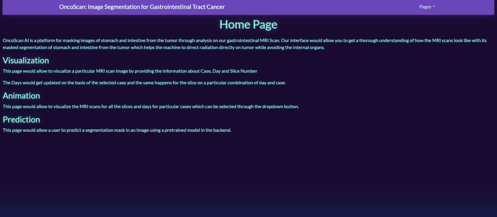
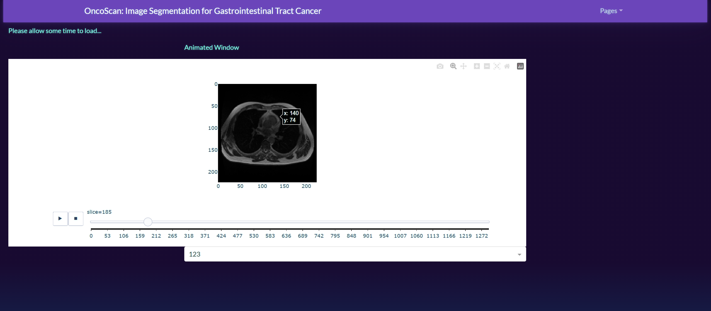
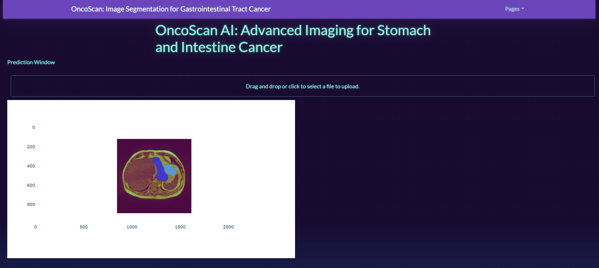
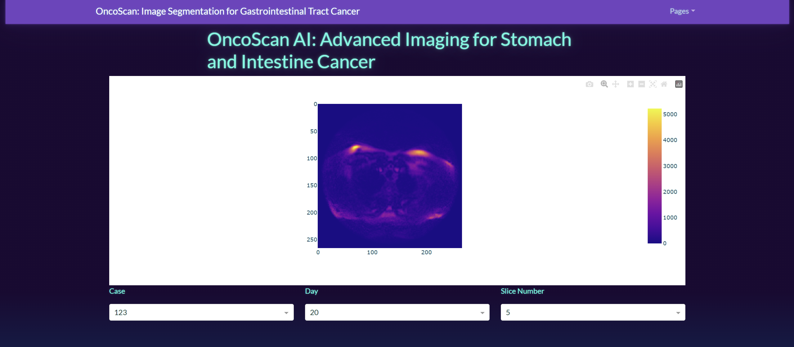

# OncoScan AI: Image-Segmentation-for-Gastrointestinal-Tract-Cancer
This repository contains codebase for the image segmentation task as part of our capstone project titled <b>OncoScan AI</b>.

Following is the description of the individual pages of the interface - 

# GUI Description

## 1. HomePage


The landing page of OncoScan AI which is used also describes about different windows in the Interface.

## 2. Animation Window



This page demonstrates the MRI scans of a chosen case using the dropdown button provided in the form of Animation using an adjustable slider.

## 3. Prediction Window



This page demonstrates the prediction window where a user can upload any MRI scan and get a predicted mask as an output figure on the interface itself. The above image demonstrates the predicted mask from an input `case 108`, `Day 13` and `slice 74`. 

## 4. Visualization Window



This page is used to visualize individual MRI scans by choosing specific combination of `case`, `day` and `slice`.


The project is currently in progress and there would be soon further progress made towards improving the models associated with it.

# Installation

```{python}
pip install -r requirements.txt
```

The above command would installed all of the dependencies for the project. Next run the following command to start the interface.

# Run

```{python}
python app.py
```
